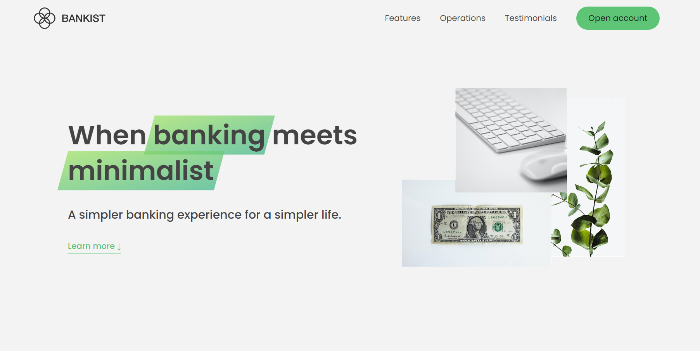

[![Contributors][contributors-shield]][contributors-url]
[![Forks][forks-shield]][forks-url]
[![Stargazers][stars-shield]][stars-url]
[![Issues][issues-shield]][issues-url]
[![LinkedIn][linkedin-shield]][linkedin-url]
  
  <h3 align="center">Bankist Landing Page</h3>
  

    <a href="https://github.com/alyQamar/Bankist-landing-page"><strong>Explore the docs »</strong></a>
     
     
    <a href="https://alyqamar.github.io/Bankist-landing-page">View Demo</a>
    ·
    <a href="https://github.com/alyQamar/Bankist-landing-page/issues">Report Bug</a>
    ·
    <a href="https://github.com/alyQamar/Bankist-landing-page/issues">Request Feature</a>
  

Table of Contents

  <ol>
    <li><a href="#about-the-project">About The Project</a></li>
    <li><a href="#features">Features</a></li>
    <li><a href="#built-with">Built With</a></li>
    <li><a href="#how-to-use">How to Use</a></li>
    <li><a href="#contributions">Contributions</a></li>
    <li><a href="#resource">Resource</a></li>
  </ol>
  
## About The Project

Welcome to the Bankist landing page repository! This repository contains the source code for a landing page template built using HTML, CSS, and JavaScript. This template is fully responsive.

<h1 align="center">
    
</h1>

[Live Demo](https://alyqamar.github.io/Bankist-landing-page) 

## Features
- [x] Sticky navigation 
- [x] Reveal sections with scrolling
- [x] Lazy loading images with scrolling
- [x] Dynamic slider section

## Built With
* HTML
* CSS
* JavaScript

Note: I coded the javascript code and use (html and css) code which coded by Jonas Schmedtmann. 

---

## How to Use

1. Clone or download the repository.
2. Open the `index.html` file in your browser to view the landing page.
3. Customize the HTML, CSS, and JavaScript to suit your needs.

## Contributions

I welcome contributions to this repository, whether in the form of bug fixes, new features, or design improvements. If you would like to contribute, please create a pull request and I will review it as soon as possible.

Thank you for visiting the Landing Page repository! I hope it helps you create a beautiful and functional landing page.

## Resource

this project was developed in The Complete JavaScript Course 2022: From Zero to Expert! course 
https://www.udemy.com/course/the-complete-javascript-course/

Created by [Jonas Schmedtmann](https://github.com/jonasschmedtmann)  
Developed by [@Aly Qamar](https://www.linkedin.com/in/alyqamar) - alyelsamouly@gmail.com  

<!-- MARKDOWN LINKS & IMAGES -->
[contributors-shield]: https://img.shields.io/github/contributors/alyQamar/Bankist-landing-page.svg?style=for-the-badge
[contributors-url]: https://github.com/alyQamar/Bankist-landing-page/graphs/contributors
[forks-shield]: https://img.shields.io/github/forks/alyQamar/Bankist-landing-page.svg?style=for-the-badge
[forks-url]: https://github.com/alyQamar/Bankist-landing-page/network/members
[stars-shield]: https://img.shields.io/github/stars/alyQamar/Bankist-landing-page.svg?style=for-the-badge
[stars-url]: https://github.com/alyQamar/Bankist-landing-page/stargazers
[issues-shield]: https://img.shields.io/github/issues/alyQamar/Bankist-landing-page.svg?style=for-the-badge
[issues-url]: https://github.com/alyQamar/Bankist-landing-page/issues
[linkedin-shield]: https://img.shields.io/badge/-LinkedIn-black.svg?style=for-the-badge&logo=linkedin&colorB=555
[linkedin-url]: https://www.linkedin.com/in/alyqamar/
